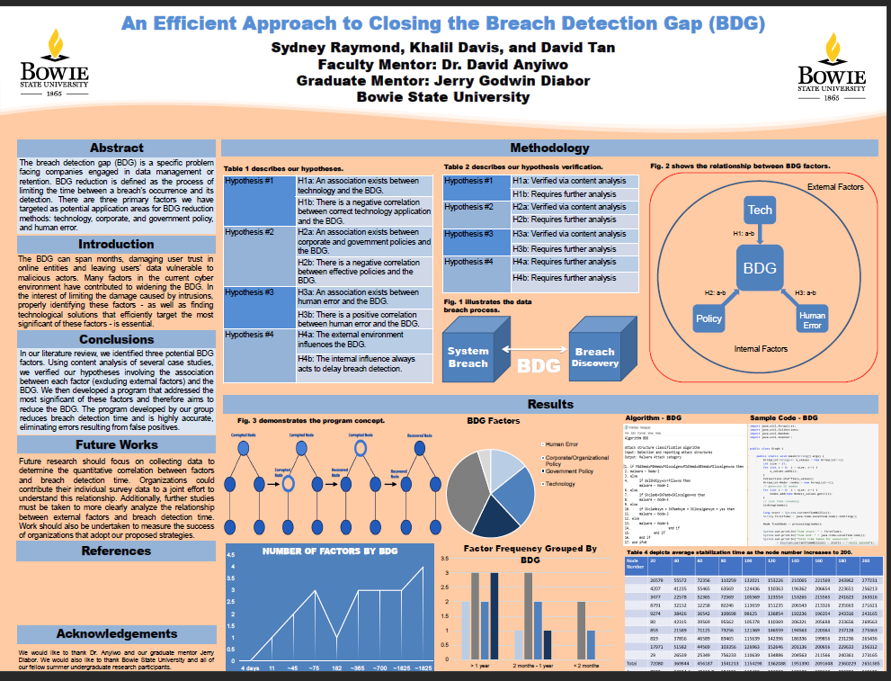

# This is the REU for Bowie State University in Cybersecurity

# Title: AN EFFECTIVE APPROACH TO CLOSING THE BREACH DETECTION GAP (BDG) 

### Team members: 
- [Syndey]
- [Khalil]
- [David Tan](https://github.com/skytruong90)

## Our Objective: 

## How view the paper, poster, and presentation:
1. In order to view the full presentation, go to the folder `Our Presentation`
2. The poster can be view by going to the poster image 
3. The paper can be view going to the `Research Paper.pdf`

## This is the paper:

## This is the poster:

## This is our presentation:

