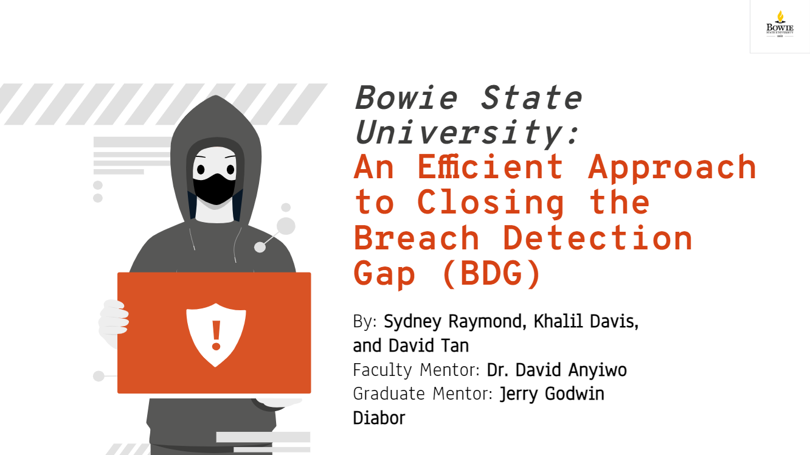

# This is the REU for Bowie State University in Cybersecurity

# Title: AN EFFECTIVE APPROACH TO CLOSING THE BREACH DETECTION GAP (BDG) 

### Team members: 
- [Syndey]
- [Khalil]
- [David Tan](https://github.com/skytruong90)

## Our Objective: 

## How view the paper, poster, and powerpoint:

## This is the paper:

## This is the poster:

## This is our presentation:

